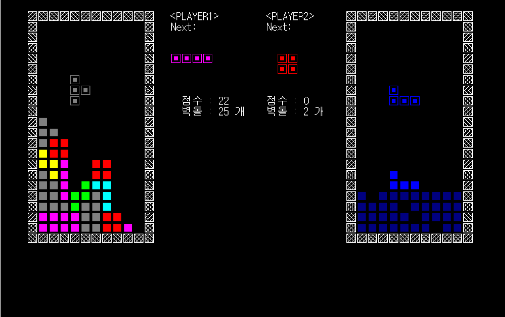
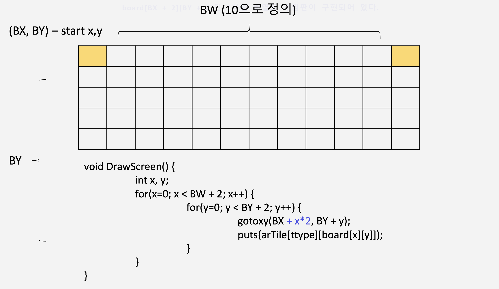
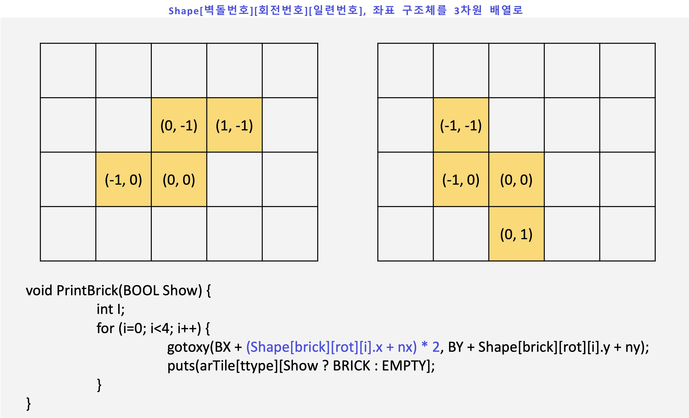

# About Battle Tetris



## 1. 게임의 흐름 및 진행

전역변수 `finish1`(플레이어1의 상태를 체크), `finish2`(플레이어2의 상태를 체크) 둘 중 하나라도 세트(1의 값을 가짐)되어 있으면 게임이 진행된다.

게임의 종료 여부는 전역변수 `game1, game2` 가 0의 값을 갖느냐의 유무에 따라 결정된다. 즉 0값을 가지면 게임이 종료된다.

게임은 사용자로부터 `kbhit` 으로 키보드 입력 여부를 확인하며 각 상황에 대한 처리는 다음과 같다.

1. 눌렸을 경우
   `InputKey()` 함수로 처리한다. 플레이어1과 플레이어2가 입력한 키를 각각 `switch` 문으로 구분하여 연산을 실행한다. 각 플레이어가 입력하는 키의 정보는 `battle.h` 에 정의되어 있다.
2. 누르지 않았을 경우
   `Player1()` 과 `Player2()` 함수가 각각 호출된다. `Player` 함수의 핵심 기능 다음과 같다.
   1. 생성된 블록의 모양, 다음에 생성될 블록의 모양을 결정한 후 출력
   2. 게임 정보 (스코어 및 현재까지 생성된 블록의 총 개수) 갱신 및 출력
   3. 게임을 계속 이어나갈 수 있는지 확인 및 그에 따른 대처
   4. `nStay` 와 `nFrame` 을 활용한 역카운팅 기법과 게임 시간 제어
   5. 블록을 한 칸 아래로 이동시키는 함수 호출 

## 2. 배틀 시스템

1. 승리조건: 최종 스코어를 기준으로 승패가 결정된다. 누가 먼저 탈락되느냐는 중요하지 않다.
2. 공격조건: 3줄 이상을 한꺼번에 제거하게 되면 상대에게 자신이 삭제한 줄 수만큼 더미 블록라인을 쌓아 올릴 수 있다. 더미블록은 한 줄의 블록에 랜덤한 위치에 블록이 하나 뚫려 있는 블록 라인을 의미한다.

## 3. 게임 디자인

### 3.1 게임판의 구현



`board[BX+2][BY+2]` 배열을 생성한다. 가로 길이(BX)rk 10, 세로 길이(BY)가 20인 게임판을 상상하면서 배열을 구현했다. 본래 세로에 해당하는 `BY` 가 앞에 오는 `board[BY+2][BX+2]` 가 의미상으론 맞지만 본 게임 소스코드에서는 그래픽의 출력 위치를 정할 때 `gotoxy` 함수를 호출하면서 정하기 때문에 그럴 필요가 없다. 2칸씩 여유(+2)가 있는 것은 게임판의 외벽을 표현하기 위해 설정해뒀다.

`Player1` 을 출력할 때는 `board[BX+2][BY+2]` 에 저장되어 있는 정보를 (`BX1 + (Shape[brick][rot][i].x + nx1) * 2, BY + Shape[brick][rot][i].y + ny1)` 수식을 활용하여 화면에 블록을 출력한다. `BX1, BY` 는 출력이 시작되는 기준점이다. 이 기준점으로부터 우측 하단 방향으로 게임판과 블록들이 출력될 것이다. `Player2` 의 경우 `Player` 과 `BY` 값은 공유하고 `BX` 값을 다르게 해주는 것이 바람직하다. 따라서 `Player2` 의 x좌표는 `BX2` 로 정의되어 있다. 출력하는 공백, 블록, 벽 등은 모두 2byte 크기의 캐릭터배열로 이루어져 있기 때문에 x좌표의 경우 특별히 2를 곱한 연산을 사용한다.

### 3.2 블록의 구현



x와 y좌표로 이루어진 `Shape` 구조체의 3차원 배열을 사용했다. `Shape[][4][4]` 의 크기로 구현하였다. 제일 앞에 비워져 있는 `[]` 부분에는 블록의 종류를 뜻하는 값을 사용했다. 총 7개 블록이 존재하므로 전체 배열의 크기는 `7x4x4` 가 될 것이다. `[][4][4]` 중 중간의 4는 블록의 회전 모양을 의미하는 값을 가지고, 맨 마지막 4의 값은 하나의 블럭을 구성하는 4개의 단위 블럭의 집합을 의미한다. `{ 0, 0}` 과 같은 단위 블럭의 좌표가 4개 모여 하나의 온전한 블록을 이룬다. 그렇기 때문에 하나의 블록을 화면에 출력하려면 반복 연산으로 `Shape[][][0] ~ Shape[][][3]` 과 같이 출력해줘야 한다.

하나의 블록은 최대 4개의 모양으로 회전이 가능하다. 물론, 회전 모양이 4개가 아닌 블록(1자 블록)도 존재하지만 구현에 있어 통일성 있는 코드를 짜기 위해 하나로 통일했다. 회전 모양이 적은 블록들은 중복된 모양으로 값을 채워 넣었다.

블록의 색깔은 다음과 같이 구현했다. 먼저, `color[BW+2][BH+2]` 라는 별도의 컬러 기록판이 정의되어 있다. `brickColor[7]` 배열을 사용하여 7개 블록에 대한 고유의 색을 지정했다. `color` 기록판에 기록을 할 때, 혹은 그 컬러를 알아내어 블록을 그 색깔로 출력하고 싶을 때는 블록의 모양을 결정하는 `brick` 전역함수를 사용하여 `brickColor[brick]` 으로 컬러 값을 알아내어 `textcolor()` 함수를 호출하면 된다.

블록의 모양에는 이차원 캐릭터포인터 배열이 사용되었다. 

```c
int ttype = 0;
char *arTile[][3] = {
	{ "  ","▣","▩" }, // 새로 생성되었을 때의 블럭 모양
	{ "  ","■","▩" }, // 바닥에 닿았을 때의 블럭 모양
}; // 크기 3의 문자열 배열, 각 타일은 2개의 char로 구성된다.
   // "  " 공백의 경우 2byte로 구성되어 있고 기존에 출력된 블럭을 지울 때 주로 사용된다.
   // 위에 선언되어 있는 열거형 멤버변수를 각 타일에 그대로 매핑시켜 타일배열의 인덱스로 사용할 것이다.
```

착지했을 때, 블록이 내려오고 있을 때 이 두가지 경우의 구분을 주기 위해 이차 배열을 선언하였다. 위의 `ttype` 값을 1로 변경하기만 하면 모양의 변경이 가능하다.

### 3.3 게임의 속도 및 블록의 하강 구현

#### 3.3.1 역카운팅 기법

`Player` 함수와 `Player2` 함수를 설계할 때, 0.05초 간격으로 실행되도록 `delay` 를 주었다. 그리고 `Player1` 함수와 `Player2` 함수 내부에 `nFrame` 과 `nStay` 전역 변수를 사용하여 카운팅을 하게끔 구성하였다. 

초기의 `nFrame` 값은 20으로 설정되어 있고 `nStay` 가 `nFrame` 값을 가져오므로 0.05초 간격으로 20번을 돌게끔 설정되어 있다. 즉, 0.05초 내에 오는 사용자 입력을 인지할 수 있으며 1초가 채워지면 블록이 한 칸 아래로 하강하도록 구성되어 있다. 간소화된 코드는 다음과 같다.

```c
if (--nStay1 == 0) {
    nStay1 = nFrame1;
    if (MoveDown1()) {
        return TRUE;
    }
}
```

#### 3.3.2 게임의 난이도

아래의 코드는 `Player2` 의 난이도 조절을  하는 코드인데, `Player1` 과 구조가 완전히 동일하다. 먼저 커다란 조건문을 보면 `offset` 이 1인지 0인지에 따라 나뉜다. 우선 켜져 있는 것이 초기상태이니 `if` 블록 내로 진입한다. 

속도의 조절은 지금까지 등장한 블록의 개수(`bricknum`)를 기준으로 한다. `bricknum` 이 100보다 작을 때는 `nFrame` 값이 5이하로 떨어지지 않는다. 즉 아무리 속도가 빨라져봐야 블록이 하강하는 속도가 `0.25` 초 이하로 될 일은 없다는 것이다. (`0.0 * 5 = 0.25`)

하지만 블록의 개수가 100개 이상이 될 때부터는 최대 0.05초 간격으로 하강할 수 있게 된다.

```c
if (offset2) {
    if (bricknum2 < 100 && bricknum2 % 10 == 0 && nFrame2 > 5) {
        virtualNum2 = bricknum2 + 1;
        nFrame2--;
        nStay2 = nFrame2;
        offset2 = 0;
    } else if (bricknum2 >= 100 && bricknum2 % 10 == 0 && nFrame2 > 1) {
        virtualNum2 = brickNum2 + 1;
        nFrame2--;
        nStay2 = nFrame2;
        offset2 = 0;
    }
}  else {
    if (bricknum2 == virtualNum2) {
        offset2 = 1;
    }
}
```

