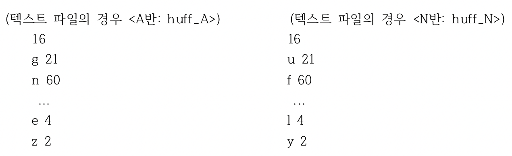

# Huffman implementation

본 구현은 다음과 같은 요구사항들을 구현한 것입니다. 요구사항과 실행방법 및 동작에 대해 설명합니다.

## 프로그램 요구사항 

1. 히프에 입력하려는 자료의 개수를 입력 받아, 동적으로 메모리 공간을 할당합니다. 하나의 자료에는 문자와 그 문자의 빈도수 정보가 저장됩니다. 자료 입력은 표준 입출력과 데이터 파일로 이루어질 수 있습니다.

2. 입력받은 개수 만큼 아래와 같은 순서대로 문자와 빈도수 정보를 입력 받고, 입력된 문자에 대한 중복을 검사하여, 유일한 문자를 지닌 자료들만 입력되도록 합니다. 문자 다음의 괄호 안에 있는 정수는 그 문자의 빈도수를 나타냅니다. 또한, 이러한 문자와 빈도수 정보를 텍스트 파일 형태로 만들어 입력으로도 사용할 수 있어야 합니다. (테스트용으로 사용한 텍스트 파일도 같이 제출할 것) 단, 문자의 개수는 제한이 없어야 함.

    (A반의 경우) 16개 g(21), n(60), t(4), k(6), c(15), i(20), d(34), a(10), u(9), p(7), f(14), s(30), x(25), e(4), l(16), z(2)
    (N반의 경우) 16개 u(21), f(60), k(4), d(6), a(15), s(20), n(34). g(10), p(9), x(7), c(14), i(30), t(25), l(4), e(16), y(2)
    

3. 입력받은 자료의 빈도수를 이용하여 허프만 트리를 최소 히프를 이용하여 생성합니다. 허프만 트리를 생성하는데 있어서, 추가되는 노드는 “W-n”(n은 1부터 시작하는 숫자) 형식의 문자 정보를 지닌다고 가정합니다.
   강의 시간에 설명한대로, 히프에 자료가 삽입되거나 삭제될 때 마다, 히프의 노드들을 preorder traversal 방식으로 출력합니다. 최종 생성된 허프만 트리에 대해서도 preorder traversal 방식으로 순회한 노드들을 출력합니다. 단, 히프와 트리의 노드를 출력할 때는 해당 노드의 문자 정보를 출력합니다. (허프만 트리의 형태는 유일하지 않을 수 있음)

4. 최종 생성된 허프만 트리에 대하여 8장 연습문제 23번과 같이, 입력된 문자에 대하여 부여되는 허프만 코드를 생성하여, 출력하도록 합니다. 또한, 주어진 문자 수에 따라 필요한 고정 길이의 비트 수로(예를 들면, 16개 문자들에 대해서 4비트, 20개 문자들은 5비트 등) 문자 코드를 생성했을 때의 사용된 총 비트 수와 허프만 코드를 사용했을 때의 사용된 총 비트 수를 계산하여, 비교, 출력하기 바랍니다.

5. 아래와 같은 문장에 대하여, 4.번에서 결정된 허프만 코드를 사용하여 코드 형태로 출력합니다. 그 다음, 출력된 허프만 코드들을 다시 입력하여 아래와 동일한 문장이 출력되는지 확인하기 바랍니다.

    (주간의 경우) kinladagutcatpinxseefee
    (야간의 경우) sindalagutpatcinxkeefee

6.  다음은 예시 입니다. 입력받은 개수 만큼 아래와 같은 순서대로 문자와 빈도수 정보를 입력 받고, 입력된 문자에 대한 중복을 검사하여, 유일한 문자를 지닌 자료들만 입력되도록 합니다. 문자 다음의 괄호 안에 있는 정수는 그 문자의 빈도수를 나타냅니다.

    문자 개수? 3
    문자? n
    빈도수? 10
    문자? d
    빈도수? 5
    문자? i
    빈도수? 30
    ......

7. 입력받은 자료의 빈도수를 이용하여 허프만 트리를 최소 히프를 이용하여 생성합니다. 허프만 트리를 생성하는데 있어서, 추가되는 노드는 “W-c”(c는 1부터 시작하는 숫자임) 형식의 문자 정보를 지닌다고 가정합니다.
   강의 시간에 설명한대로, 히프에 자료가 삽입되거나 삭제될 때 마다, 히프의 노드들을 preorder traversal 방식으로 출력합니다. 생성된 허프만 트리에 대하여 preorder traversal 방식으로 순회한 노드들을 출력합니다. 단, 히프와 트리의 노드를 출력할 때는 해당 노드의 문자 정보를 출력합니다. (허프만 트리의 형태는 유일하지 않을 수 있음)

    n
    d n
    d n i
    ......

    W-2 W-1 d n i ......

8. 최종 생성된 허프만 트리에 대하여 8장 연습문제 24번과 같이, 입력된 문자에 대하여 부여되는 허프만 코드를 생성하여, 출력하도록 합니다. 또한, 입력된 16개의 문자에 대해서 4비트로 문자 코드를 생성했을 때의 사용된 총 비트 수와 허프만 코드를 사용했을 때의 사용된 총 비트 수를 계산하여, 비교, 출력하기 바랍니다.

    n: 10
    d: 11
    i: 0
    ......

    4-비트 코드 시: ??? bits
    허프만 코드 시: xxx bits

9. 아래와 같은 문장에 대하여, 4.에서 결정된 허프만 코드를 사용하여 코드 형태로 출력합니다. 그 다음, 출력된 허프만 코드들을 다시 입력하여 아래와 동일한 문장이 출력되는지 확인하기 바랍니다.

    (set1) kinladagutcatpinxseefee
    (set2) sindalagutpatcinxkeefee

    문자열? kinla.....
    코드열: 00100......

    코드열? 00100......
    문자열: kinla......

## 실행 및 테스트법

1. 최대 30개까지의 문자를 테스트할 수 있는 프로그램입니다. 최대 테스트할 수 있는 문자의 개수는 언제든지 수정할 수 있습니다. 프로그램의 일관성을 위해 추가해 놓은 제약입니다.

2. 먼저 테스트를 원하는 문자의 개수를 입력한 후, 개수에 맞게 각기 다른 문자 하나와 빈도수를 입력합니다. 입력은 첨부한 텍스트 파일을 복사하여 콘솔 창에 붙여넣기 하는 방식이 간편합니다.
    

3. 입력이 끝난 후 엔터를 누르면 결과들을 볼 수 있습니다.

4. preorder_traversal_heap: 유저가 입력한 문자와 빈도수를 토대로 프로그램 내의 힙 삽입 연산이 발생할 때마다 그때그때의 힙 상황을 전위순회 방식으로 출력합니다.
    

5. preorder_traversal_huffman_tree: 완성된 허프만 트리를 전위순회 방식으로 순회하며 각 노드의 정보를 출력합니다.
    단말 노드일 경우 유저가 입력한 문자 표시되며 허프만 트리 생성 과정에서 생성된 중간 노드는 W-n(n은 순차적으로 부여된 숫자) 형태의 정보로 표시됩니다.
    

6. print storage neede to fixed expressions | variable expressions: 허프만 트리를 이용할 시의 길이 계산과 고정 길이 방식을 채택했을 때의 계산을 진행하고 결과를 출력합니다.
    

7. incode huffman or decode huffman: 생성된 허프만 트리, 코드를 바탕으로 인코딩과 디코딩 과정을 진행합니다. 유저가 원하는 인코딩 문자를 입력하면, 각 문자에 해당하는 허프만코드들을 출력합니다. 단, 기존에 입력 했던 문자 외의 것을 입력하면 안됩니다.
    

    또한 출력된 허프만코드들을 다시 디코딩을 위해 넣어주면 본래의 문자가 출력됩니다.
    