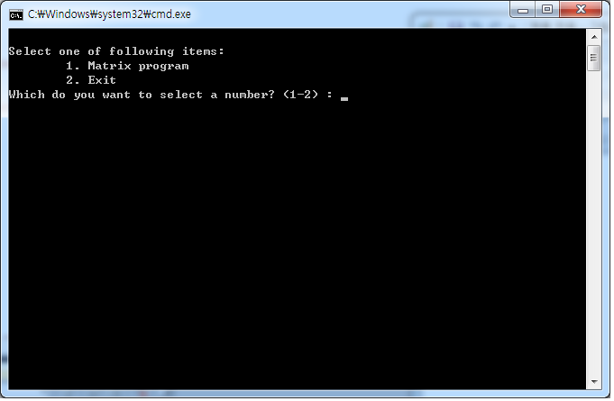
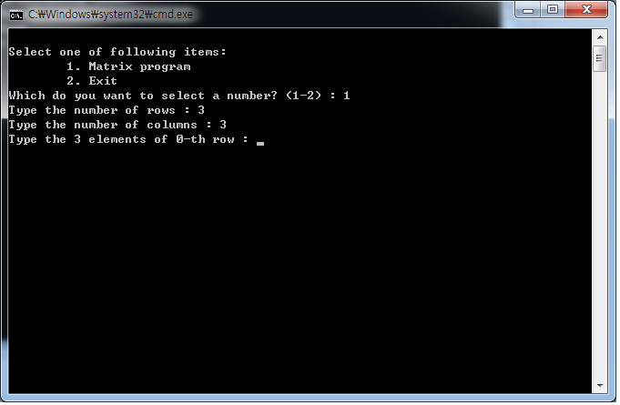

# Sparse Matrix Programming

## 1. 개요

어떠한 행렬이 주어졌을 때, 희소행렬로 저장했을 때와 그러지 않았을 때의 용량 차이를 비교하여 출력해주는 프로그램이다. 

## 2. 조작법 및 실행화면

* 1을 입력하여 프로그램을 진행한다.



* 행과 열의 개수를 입력하고 행렬 안에 들어가는 값을 입력한다.




* 입력을 마치면 위와 같이 메모리 사용량의 차이를 보여주는 결과를 출력한다. 0이 많은 배열의 경우 희소행렬을 사용하는 것이 메모리 사용을 더 효율적으로 할 수 있음을 알 수 있다.

## 3. 주요 코드 리뷰

### 3.1 희소 행렬로 구성되어 있는 배열을 생성

```c
int **ppArr;

ppArr = (int **)malloc(sizeof(int *) * rows); // 행렬자체를 저장하는 방식을 나타낼 때 쓰일 int **ppArr 동적할당

for (i = 0; i < rows; i++)
{
    *(ppArr + i) = (int *)malloc(sizeof(int) * cols);
    printf("Type the %d elements of %d-th row : ", cols, i);
    for (j = 0; j < cols; j++)
    {
        scanf("%d", *(ppArr + i) + j);
        if (ppArr[i][j] != 0)
            terms++; // 희소행렬을 생성할 때 쓰일 변수, 0이 아닌 원소의 갯수를 카운팅한다.
    }
}
```

### 3.2 위에서 생성한 행렬을 토대로 희소행렬을 생성

0이 아닌 갯수를 카운팅하여 0이 아닌 갯수만큼 구조체 배열을 동적으로 할당하였다. 3.1에서 작성된 배열의 원소들을 순차탐색으로 읽어들이며 0인지 아닌지 유무를 판별하고 0이 아닌 요소가 발견되면, 해당 요소의 행과 열의 정보를 구조체 배열의 원소로 저장한다.

```c
	for (i = 0; i < rows; i++) // 위에서 할당된 희소행렬을 바탕으로 
	{
		for (j = 0; j < cols; j++)
		{
			if (ppArr[i][j] != 0)
			{
				pElement[cntStruct].row = i;
				pElement[cntStruct].col = j;
				pElement[cntStruct].val = ppArr[i][j];
				temp--;
				cntStruct++;
				if (temp == 0)
					break;
			}
			if (temp == 0)
				break;
		}
		if (temp == 0)
			break;
	}
```

